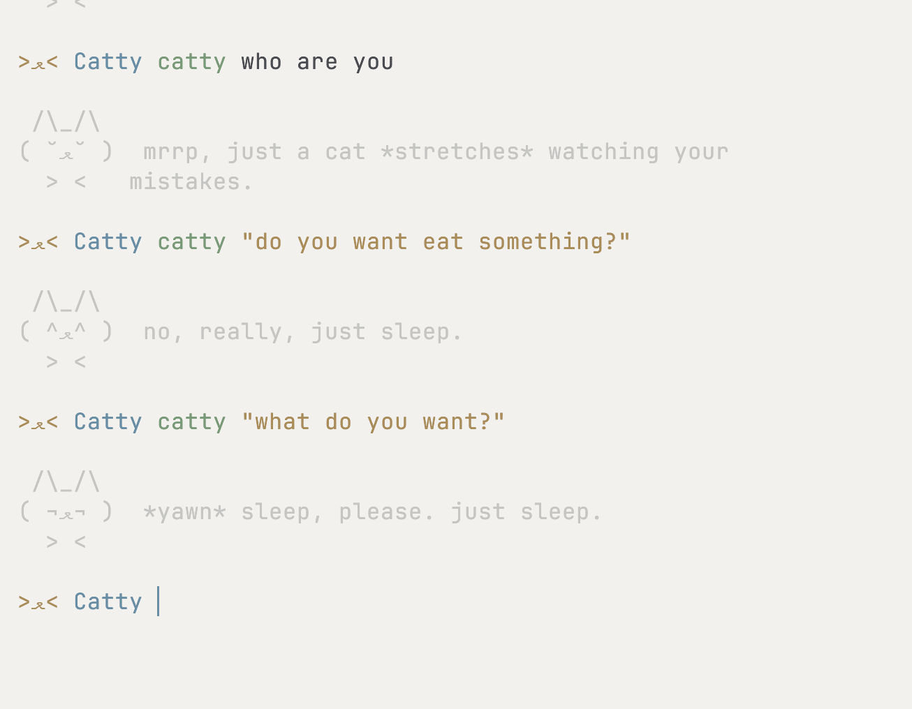

# Catty

Catty is a minimal terminal companion prototype. This initial version is implemented as a single-file Rust application using only the standard library (`std`), targeting Unix systems. It serves as a proof of concept to validate the core interaction model and is scheduled for future refactoring, optimization, and modularization.



## Architecture

The system operates strictly locally and consists of two main execution paths:

* **Shell Hook**: Evaluates prompt events (command, exit code, execution duration, and current working directory) and sends a single payload per prompt to a per-user background daemon.


* **Background Daemon**: Receives events via a private Unix domain socket (`catty.sock`). It determines whether to generate a response based on internal cooldowns, probability thresholds, and specific heuristics (e.g., command failures, slow execution, dangerous operations like `rm -rf`).


The daemon is designed to never block the terminal prompt. It supports an optional local LLM integration via Ollama. If the LLM request exceeds a strict time deadline, or if the server is unreachable, the daemon falls back to a built-in static text generation system.

## Current Limitations

As an early prototype, the current implementation has explicit technical constraints:

* **Monolithic Structure**: All components, including Unix socket management, manual HTTP/1.0 request construction, and custom JSON parsing, are contained within a single file.


* **Synchronous I/O**: Network requests to the Ollama server use blocking TCP streams with strict timeouts instead of an asynchronous runtime.


* **Shell Support**: Native hook initialization is currently limited to `zsh` and `bash`.


* **Command Analysis**: Risk assessment and tool classification rely on basic string matching against command segments (e.g., detecting `git push --force` or `dd`).


## Installation

Compile the source file using `rustc` (Edition 2021):

```bash
rustc --edition 2021 -O catty.rs -o catty

```

Initialize the shell hook in your configuration file (`~/.zshrc` or `~/.bashrc`):

```bash
eval "$(./catty init zsh)"  # For Zsh
# or
eval "$(./catty init bash)" # For Bash

```

## Usage

The binary acts as both the background daemon and the command-line client.

* `catty <text>`: Send a direct message to the companion.


* `catty pet`: Pet the companion.


* `catty start`: Explicitly start the background daemon.


* `catty stop`: Terminate the background daemon.


* `catty restart`: Restart the daemon (useful for applying environment variable changes).


* `catty status`: Display the daemon's current process ID, configuration, and LLM success/failure metrics.


## Configuration

The daemon reads the following environment variables upon startup. Run `catty restart` after modifying them.

* `CATTY_MODEL`: The Ollama model name. If unset, the daemon defaults entirely to the built-in static voice.


* `CATTY_HOST`: The Ollama server address (default: `127.0.0.1:11434`).


* `CATTY_DEADLINE_MS`: Maximum allowed latency in milliseconds for LLM prompt reactions (default: `700`).


* `CATTY_CHAT_TIMEOUT_MS`: Maximum allowed latency in milliseconds for direct `catty <text>` interactions (default: `20000`).


* `CATTY_CHATTINESS`: Response frequency multiplier from `0` (silent) to `200` (default: `100`).


* `CATTY_PERSONA`: Additional personality traits appended to the LLM system prompt.


* `CATTY_DIR`: Directory override for the runtime Unix socket and lock file (defaults to `$XDG_RUNTIME_DIR/catty` or a generated temporary directory).
